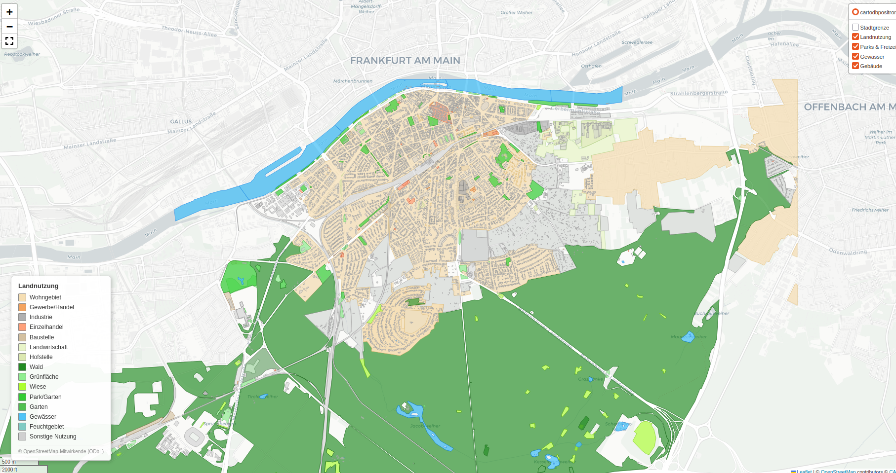

# GeoAI Maps — Automatische Landnutzungskarten mit OpenStreetMap

Zwei Python-Skripte zur automatischen Generierung von Landnutzungskarten aus OpenStreetMap-Daten. Unterstützt jede beliebige Stadt als Eingabe.

## Vorschau

### Interaktive Karte (Folium)


**Live-Demo:** [tullah-gis.github.io/geoai-maps](https://tullah-gis.github.io/geoai-maps/)

### Druckfertige PNG-Karte


---

## Skripte

### `landnutzungskarte.py` — Druckfertige PNG-Karte
Erstellt eine hochauflösende Karte (300 DPI) mit Legende, Nordpfeil und Quellenangabe.

```bash
# Standard: Frankfurt am Main
python3 landnutzungskarte.py

# Beliebige Stadt
python3 landnutzungskarte.py "Berlin, Germany"
python3 landnutzungskarte.py "München, Germany"
```

### `interaktive_karte.py` — Interaktive HTML-Karte
Erstellt eine interaktive Folium-Karte mit Hover-Tooltips und Layer-Schalter.

```bash
# Ohne Gebäude (~0.4 MB)
python3 interaktive_karte.py "Frankfurt am Main, Germany"

# Mit Gebäuden (~5 MB)
python3 interaktive_karte.py "Frankfurt am Main, Germany" --buildings
```

**Hover-Tooltip** zeigt: Nutzungsklasse · Fläche in m² · OSM-Tag

---

## Installation

```bash
pip install osmnx geopandas matplotlib contextily folium shapely
```

---

## Landnutzungsklassen

| Farbe | Klasse |
|---|---|
| 🟫 | Wohngebiet |
| 🟧 | Gewerbe / Handel |
| ⬜ | Industrie |
| 🟩 | Wald / Park / Grünfläche |
| 🔵 | Gewässer |
| 🟥 | Gebäude |

---

## Datenquellen

- **OpenStreetMap** © OpenStreetMap-Mitwirkende ([ODbL](https://www.openstreetmap.org/copyright))
- **Hintergrundkarte:** CartoDB Positron
